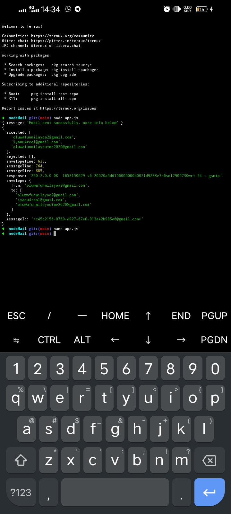
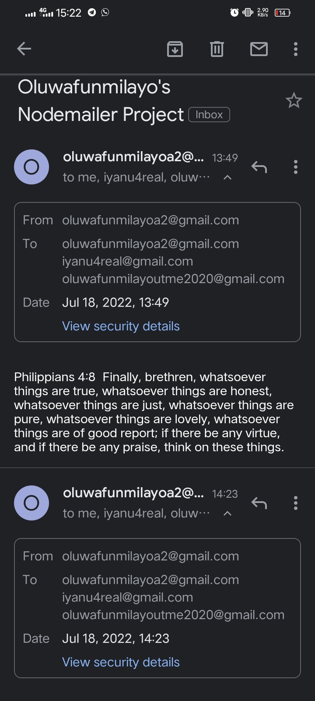

# **NODEMAILER PROJECT**


---
  
> ##### This is a basic use-case/scenerio of the npm module ``nodemailer``. This program requires just two dependencies ``dotenv`` and ``nodemailer``, but if you want to declare your authentication details explicitly, makes it even juicer 😋 because you can ignore ``dotenv``, Nodemailer's the real deal here.
  >>
     PS: No hate intended.
     
---
> ##### Something more elaborate is cooking. Hence ignore the few 'not-so-related' lines of code in ``app.js`` , when it's done, I'll leave a link here. However we'll make good use of this one. I'm excited already. Yipee! 😁🎉🎉
>>  ###### *Hugs* and *Kisses*, 💜🤗***Adenuga Oluwafunmilayo***😘💜
---
> ##### With what we have here you can send automated emails by executing the main file ``app.js``. 

> ##### I demonstrated sending emails to multiple destinations(Bulk messaging), Feel free to play with that in the ``to: ' ',`` field.

> ##### Also you can modify the contents of the Mail subject and body by correcting the ``subject: ' ',`` and ``text: ' '`` fields respectively.
     
---
---
## **GETTING THE NODEMAIL PROGRAM TO WORK IN THREE EASY STEPS** 🪜🪜🪜
---
---
> #### STEP 1 🪜
> ##### To begin, run the following code in your terminal.
> ##### ``git clone https://github.com/Fumelo01/nodeMail``
     
---

 > ##### Dependencies
  >> ###### *nodemailer*, *dotenv (If you are going to create a .env file)*
     
 > ##### Authentication
  >>###### The Authentication method I made use of here is `OAuth2`. If you don't know how to go about it, you should check this [article](https://www.freecodecamp.org/news/use-nodemailer-to-send-emails-from-your-node-js-server/).
      
---
> #### STEP 2 🪜
> ##### Once the dependencies are installed, set the authentication details and save. 
     
---
> #### STEP 3 🪜
> ##### From the root folder 'nodeMail' , run ```node app.js``` 
     
---
---
> ###### Voila! There you have it.
>> ###### If you performed all 3 steps correctly, Emails will be sent to all the destination accounts you specified. You should check your Mailbox to confirm this
     
---
> ### *Whilst making this program, I sent over twenty mails to myself. Don't tell* 🤭 😊. *Below are samples.*
  


    


